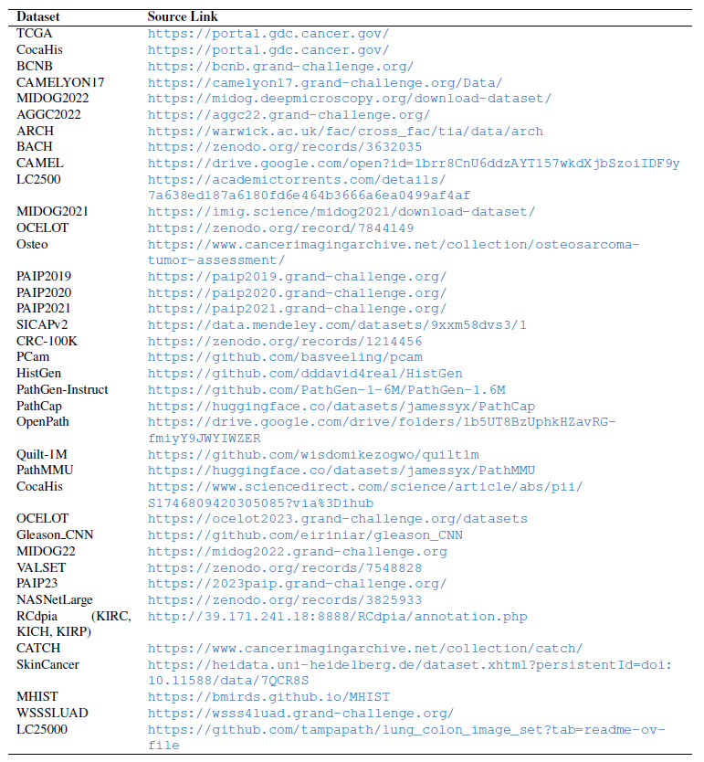

[上一级](README.md)

---

## 1 数据集
基准数据集如下：
1. [**Camelyon16**](https://camelyon17.grand-challenge.org/)：270训练 (159正常111异常)、129测试，包含实例级别标签；
2. [**TCGA肺癌数据集**](https://portal.gdc.cancer.gov/files/608e2269-04b4-4a20-aca8-d20f36800cc3)：包含肺癌等多个子数据集，例如为LUSC、LUAD，文件下载索引可以参照[DSMIL](https://github.com/binli123/dsmil-wsi/tree/master/tcga-download)；

具体的下载链接如下：

|名称|                                                    官网                                                    |  类型  | 类别 | 实例标签 | 类别平衡 | 文本描述 
|:----------------:|:--------------------------------------------------------------------------------------------------------:|:----:|:--:|:----:|:----:|:----:|
|AGGC2022|         [https://aggc22.grand-challenge.org/AGGC22/](https://aggc22.grand-challenge.org/AGGC22/)         | 前列腺癌 | 5  |  √   |  √   |
|ARCH| [https://warwick.ac.uk/fac/cross_fac/tia/data/arch/](https://warwick.ac.uk/fac/cross_fac/tia/data/arch/) |  混合  | 2  |      |      |  √   
|BACH|                                  [https://zenodo.org/records/3632035](https://zenodo.org/records/3632035)                                  | 乳腺癌  | 4  |  √   |  √   
|BCNB|                  [https://bcnb.grand-challenge.org/](https://bcnb.grand-challenge.org/)                  | 乳腺癌  | 3  |  √   |      |
|LC25000|[https://academictorrents.com/details/7a638ed187a6180fd6e464b3666a6ea0499af4af](https://academictorrents.com/details/7a638ed187a6180fd6e464b3666a6ea0499af4af)|肺癌和结肠癌| 5  |      |  √   |
|MIDOG2022| [https://midog.deepmicroscopy.org/download-dataset/](https://midog.deepmicroscopy.org/download-dataset/) |  混合  | 6  | 未调查  | 未调查  | 未调查  |
|Osteo|[https://www.cancerimagingarchive.net/collection/osteosarcoma-tumor-assessment/](https://www.cancerimagingarchive.net/collection/osteosarcoma-tumor-assessment/)|骨肉癌| 3  |      |  相对  ||

更多的下载方式可以参照 (图片来源于CPath-Omni)：

  

- **注1**：DSMIL提供了预处理版本；
- **注2**：数据集的预处理一般可以使用[**CLAM**](https://github.com/mahmoodlab/CLAM)；
- **注3**：数据集的具体信息请参照下载后的版本，如有勘误，敬请告知；
## 2 预训练模型
|        方法        | ResNet18 (512)  | ViT-small (384)  | ResNet50(1024)  |  CTransPath  
|:----------------:|:---------------:|:----------------:|:---------------:|:------------:|
| CaMIL (AAAI'24)  |        √        |        √         
| CIMIL (AAAI'24)  |||        √        
|  VINO(AAAI'24)   |        √        ||
| PAMIL (CVPR'24)  |||        √        
|  WiKG (CVPR'24)  ||        √        
| IBMIL (CVPR'23)  |        √        |        √         ||        √        
|      CSMIL       |||        √        
|      AdvMIL      |||        √        
|      ProDiv      |||        √        

- **注1**：ResNet18括号后的数字表示每个区块 (patch) 提取后的维度；
